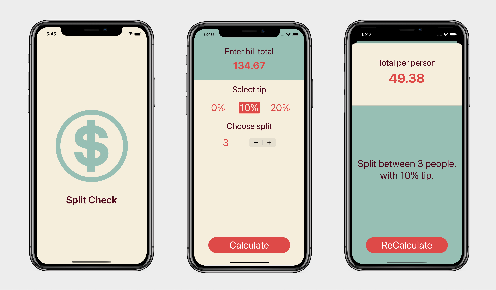

# Pair Two

[](https://www.apple.com/ios/ios-15/)
[](https://developer.apple.com/swift/)
[](https://developer.apple.com/swift/)
[](LICENCE)

<p>  </p>

Easy to play memory game with emojis, build with UIKit and MVC pattern.

## Features

- Enter bill total with number pad.
- Select tip % and between how many people.
- Show modal with total per person and description message.
- Splash screen.
- Localization support (English/Spanish).

## Development

- Development Target **15.0**
- Swift **5.0**
- Xcode **13.2**

## Build

Clone the repository and run!

# License

```xml
MIT License

Copyright (c) 2021 Anibal Ventura
```
